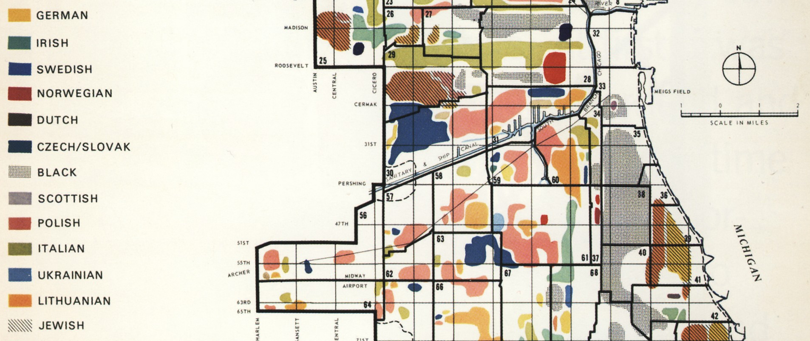

# Tribes
A map of aggregate racial/ancestral groups based on [a 1950 map of Chicago](https://upload.wikimedia.org/wikipedia/commons/b/b5/Chicago_Demographics_in_1950_Map.jpg). 



## Background
This is a tough map to recreate with 21st century data. The reason for using an aggregate approach is that the census [only reports ancestry for slightly more than half of the US population](http://factfinder.census.gov/faces/tableservices/jsf/pages/productview.xhtml?pid=ACS_13_5YR_B04001&prodType=table), including in configurations that fail to represent whole racial/ethnic groups, which are in turn detailed on other tables. In order to capture the conceptual spirit and geographic detail of the original map, it is worthwhile to combine the two in the most-representative way possible. 

This map draws from [142 distinct ancestry/race/ethnicity/origin categories from across 5 census tables](data/census_community_fields.csv).

## Data sources
 - [Census TIGER geographic boundaries - tract-level](data/cook_county_blocks.geojson)
 - [Census API SF1 and ACS](http://api.census.gov/data/2010/sf1/variables.html)
 - [Zillow neighborhoods](data/zillow_neighborhoods.geojson)
 
## Processing steps
 1. [Get geodata](build_communities.sh)
 2. [Hit the Census API for tabular data](processing/pull/index.js)
 3. Add `community` aggregate field, populated with largest ancestry/racial/ethnic group in each census tract by proportion of the population; retain proportion stats
 4. Join tract geometries, `community`, ancestry and race tables on geoid
 5. Delete empty tracts
 6. Expand block boundaries by 250m, dissolve, then erode by 275m for cartographic effect
 7. Map [according to original style](cartography/chicago_demographics.mss)
 
## Usage

### Requirements

- PosgreSQL w/ PostGIS
- node.js
- GDAL/OGR
- Census API key

In theory this will work for any county in the country. [Set location parameters here](build_communities.sh#L6-L9), then:

```bash
bash build_communities.sh
```
 
## Assumptions (a running list)
 - __Meta-assumption: ancestry can be inferred by race.__ This is a dramatic oversimplification, to say the least.
 - The largest ancestral group in a tract is related to the largest racial group in a block contained by that tract.
 - The [first ancestry reported](http://factfinder.census.gov/faces/tableservices/jsf/pages/productview.xhtml?pid=ACS_13_5YR_B04001&prodType=table) is admissible as the only ancestry.
 - Asian and Hispanic/Latino groups can be represented by race in the absence of ancestral categories encompassing them.
 - In majority-black census blocks, "American" ancestry refers almost exclusively to African-Americans.
 - The "Mixed" racial group in a block is adequately represented by the largest ancestral group in the containing tract.
 - "Hispanic/Latino" can be [represented as a race-like category](http://censusreporter.org/topics/race-hispanic/).
 - Margin of error can be ignored.
 - It's okay that the individual groupings sum to greater than the total.